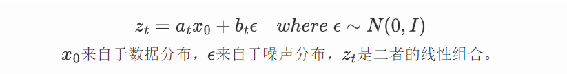
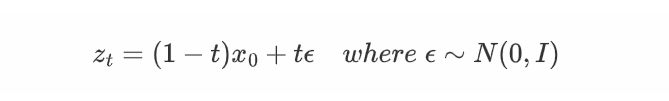
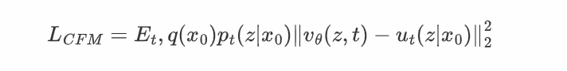
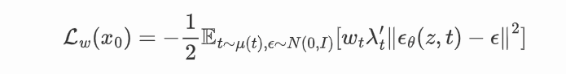
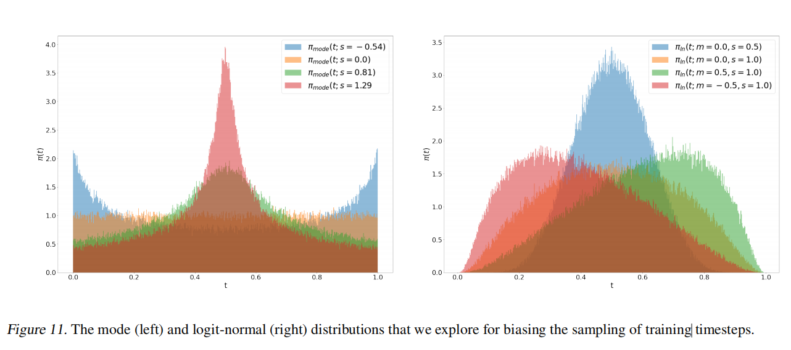

## Stable Diffusion 3 论文解读

### 1.Introduction

**Stable Diffusion 3依旧是一个End-to-End模型，最大的亮点是扩散模型部分使用了全新的MM-DiT（Multimodal Diffusion Transformer）架构。**

SD3 相关技术的解读重点主要可分为两个部分，一是关于flow matching的改进,  **SD3不再使用DDPM作为扩散模型，而是改用优化的RF（Rectified Flow）做为扩散模型；**另一方面是在Diffusion Transformer上的具体设计。

### 2. Simulation-Free Training of Flows

「Simulation-Free」指的是扩散模型的模型参数不再用来直接拟合带噪数据和干净数据分布之间的映射关系，而是通过拟合一个向量场，通过这个向量场将加噪/去噪过程给联系起来。

「Flows」指代的就是通过flow matching 的技术来实现这件事。

#### Flow Matching技术讲解

作者首先通过 普通微分方程（ODE）定义了从噪声分布p1的样本x1到数据分布p0的样本x0之间的映射：


速度v 由神经网络的权重 θ 参数化。

陈等人（2018）的先前工作建议通过可微分的ODE求解器直接解决方程。然而，这个过程在计算上是昂贵的，特别是对于参数化   v_θ (y_t, t)  的大型网络结构而言。一个更有效的替代方案是直接回归生成 p0 和 p1 之间的概率路径的矢量场 u_t 。

为了构造这样的  u_t ,作者定义一个正向过程，对应 p0 和 p1 之间的概率路径  p_t , 如下所示：



而对于Retified flow，则直接使用更简单的 二者的线性插值来表示：



接着我们用这样的一个ODE来构建一个**概率路径（probability path）** p_t , 它可以实现从一个噪声分布 p1 到另一个数据分布 p0 的流转换。**只要我们获取了  v(z_t, t)  ，我们就可以用ODE的常用求解器（如欧拉方法，Euler method等）实现从一个高斯噪声到真实数据的生成。**

所以我们在这里用一个参数为θ的SD 3模型   v_θ(z_t, t)  来建模这个向量场，希望其能逼近真实向量场 v(z_t,t) ，这时FM的优化目标就很清楚了：


接着我们再来看一个新的优化目标，那就是**Conditional Flow Matching（CFM）**目标：



这里的条件向量场 u_t(z|x_0)  产生了条件概率路径 p_t(z|x_0) ，对于FM目标和CFM目标来说，一个很重要的结论是两者之间只相差一个与参数θ无关的常量，这也就意味着使用CFM目标来训练θ和采用CM目标来训练θ是等价的。

经过一系列推导，我们可得到：


这里我们对 vθ(z,t) 进一步定义为：


代入CFM优化目标可得到：


此时相当于神经网络变成了预测噪音，这和扩散模型DDPM预测噪音是一样的，同时优化目标的多了一个和t有关的权重系数。所以，**FM其实可以看成一个采用不同的权重系数的扩散模型**。

Google的工作[[[2303.00848\] Understanding Diffusion Objectives as the ELBO with Simple Data Augmentation](https://arxiv.org/abs/2303.00848))提出了一个统一的视角,即不同的生成模型的优化目标都可以统一为：



### 3. Flow Trajectories

除了rectified flow之外，文章还简单阐述了几种其他的变式的forward过程:

- Rectified Flow

- EDM

- Cosine

- (LDM-)Linear

作者针对这几个变种进行了详细的对比实验。

#### 非均匀训练噪声采样

在学习这样一种生成模型时，会先随机采样一个时刻 t∈[0,1]，根据公式获取此时刻对应位置在生成路线上的速度，再让神经网络学习这个速度。直观上看，刚开始和快到终点的路线很好学，而路线的中间处比较难学。因此，在采样时刻 t 时，SD3 使用了一种非均匀采样分布。

如下图所示，SD3 主要考虑了两种公式: mode（左）和 logit-norm （右）。二者的共同点是中间多，两边少。mode 相比 logit-norm，在开始和结束时概率不会过分接近 0。



### 4. Text-to-Image Architecture （模型结构）


#### LDM

从整体架构上来看，和之前的 SD 一样，SD3 主要基于隐扩散模型（latent diffusion model, LDM）。这套方法是一个两阶段的生成方法：先用一个 LDM 生成隐空间低分辨率的图像，再用一个自编码器把图像解码回真实图像。

扩散模型 LDM 会使用一个神经网络模型来对噪声图像去噪。为了实现文生图，该去噪网络会以输入文本为额外约束。相比之前多数扩散模型，SD3 的主要改进是把去噪模型的结构从 U-Net 变为了 DiT。

#### Text Encoder模型

在 Stable Diffusion 3 (SD3) 中，**文本编码器（Text Encoder）** 是模型的重要组成部分，其主要功能是将输入的文本提示（Prompt）转换为高维语义表示。这些语义表示用于指导生成符合文本描述的图像。

##### 1. 文本编码

为了提升 SD3 的文本理解能力，输入文本通过以下三种文本编码器进行编码：

1. CLIP ViT-L（参数量约124M）

2. OpenCLIP ViT-bigG（参数量约695M）

3. T5-XXL Encoder（参数量约4.76B）

   T5 是一个大型的语言模型，专为处理自然语言任务而设计。因此提供了细粒度的语义信息，有助于生成更加具体和详细的图像内容。

具体实现如下所示:

```python
prompt_embed, pooled_prompt_embed = self._get_clip_prompt_embeds(
    prompt=prompt,
    num_images_per_prompt=num_images_per_prompt,
    clip_skip=clip_skip,
    clip_model_index=0,
)
prompt_2_embed, pooled_prompt_2_embed = self._get_clip_prompt_embeds(
    prompt=prompt_2,
    num_images_per_prompt=num_images_per_prompt,
    clip_skip=clip_skip,
    clip_model_index=1,
)
t5_prompt_embed = self._get_t5_prompt_embeds(
    prompt=prompt_3,
    num_images_per_prompt=num_images_per_prompt,
    max_sequence_length=max_sequence_length,
)
```

输入prompt 分别由这三个模型编码后，张维度分别为：

| Prompt   | 文本编码器        | prompt_embed                    | pooled_prompt_embed |
| -------- | ----------------- | ------------------------------- | ------------------- |
| prompt   | CLIP ViT-L        | [B, 77, 768]                    | [B, 768]            |
| prompt_2 | OpenCLIP ViT-bigG | [B, 77, 1280]                   | [B, 1280]           |
| prompt_3 | T5 XXL            | [B, 256, 4096] 或 [B, 77, 4096] | \                   |

##### 2.  拼接与填充

SD3 的 文本编码器的输出包括**全局语义特征**和**细粒度语义特征**，分别通过以下步骤进行处理：

- **全局语义（Pooled Text Embeddings）**：

​    CLIP ViT-L 和 OpenCLIP ViT-bigG 的 `pooled_prompt_embed` 沿最后一个维度拼接，生成表示全局语义的张量 `[B, 2048]`：，代表每个样本的全局语义特征，具体如下：

```python
pooled_prompt_embeds = paddle.concat([pooled_prompt_embed, pooled_prompt_2_embed], axis=-1)
```

- **细粒度语义（Text Embeddings）**：

​    首先，将CLIP ViT-L 和 OpenCLIP ViT-bigG 编码得到的 prompt_embeds 沿最后一个维度拼接，形成 `[B, 77, 2048]`的张量。

​    接着，对拼接后的张量进行零填充，使其与 T5-XXL 的最后一维对齐( `[B, 77, 4096]`)：

```python
clip_prompt_embeds = paddle.concat([prompt_embed, prompt_2_embed], axis=-1)
clip_prompt_embeds = paddle.nn.functional.pad(
    clip_prompt_embeds,
    (0, t5_prompt_embed.shape[-1] - clip_prompt_embeds.shape[-1]),
    data_format="NCL",
)
```

​    最后，将填充后的张量与 T5-XXL 的 `prompt_embed` 沿序列长度维度拼接，生成最终的细粒度语义表示 `[B, 333, 4096]`：

```python
prompt_embeds = paddle.concat([clip_prompt_embeds, t5_prompt_embed], axis=-2)
```

##### 3. 输入至 MM-DiT

- 全局语义处理

全局语义特征通过一个 MLP 网络处理，并与时间步嵌入（Timestep Embeddings）相加，用于提供条件编码：

```python
self.time_text_embed = CombinedTimestepTextProjEmbeddings( embedding_dim=self.inner_dim,pooled_projection_dim=self.config.pooled_projection_dim
        )
```

以下是 `CombinedTimestepTextProjEmbeddings` 的实现：

https://github.com/PaddlePaddle/PaddleMIX/blob/77498418ac49fadd23bbd6f7abda0d7f5b1bc01e/ppdiffusers/ppdiffusers/models/embeddings.py#L530

```python
class CombinedTimestepTextProjEmbeddings(nn.Layer):
    def __init__(self, embedding_dim, pooled_projection_dim):
        super().__init__()

        self.time_proj = Timesteps(num_channels=256, flip_sin_to_cos=True, downscale_freq_shift=0)
        self.timestep_embedder = TimestepEmbedding(in_channels=256, time_embed_dim=embedding_dim)
        self.text_embedder = PixArtAlphaTextProjection(pooled_projection_dim, embedding_dim, act_fn="silu")

    def forward(self, timestep, pooled_projection):
        timesteps_proj = self.time_proj(timestep)
        timesteps_emb = self.timestep_embedder(timesteps_proj.cast(dtype=pooled_projection.dtype))  # (N, D)

        pooled_projections = self.text_embedder(pooled_projection)

        conditioning = timesteps_emb + pooled_projections

        return conditioning
```

首先用通常的 `Timesteps` 类获取时刻编码，然后用一个 `text_embedder` 模块再次处理文本编码， `text_embedder` 是一个线性层、激活函数、线性层构成的简单模块。

最后把文本编码和时间编码加起来。

- 细粒度语义处理

细粒度语义表示则通过一个线性层映射到与图像 Latent Patch Embeddings 的维度一致，作为MM-DiT模型的文本模态。

```python
self.context_embedder = nn.Linear(self.config.joint_attention_dim, self.config.caption_projection_dim)

encoder_hidden_states = self.context_embedder(encoder_hidden_states)
```

#### VAE 模型

与之前的系列类似，SD3 的 **VAE（Variational Autoencoder）模型** 主要用于将像素级的图像数据压缩为紧凑的 Latent 表示，同时在解码阶段将 Latent 特征还原为高质量图像。相比于直接处理高分辨率的图像，Latent 表示大幅降低了计算开销。

在 SD3 中，由于扩散模型的核心部分采用了 **Transformer 架构**，VAE 的输出还需进一步处理，将 Latent 特征转换为可供 Transformer 处理的 **Patch Embeddings**。这些 Patch Embeddings 会作为扩散模型的输入，以支持生成任务。

如下图所示， Patch Embedding 生成的流程为：

- 如果输入包含图像，将图像用VAE编码为 Latent 特征，否则直接采样；
- Latent 特征转为 Patch Embeddings；
- 添加Positional Embeddings。


##### PatchEmbed 类设计

https://github.com/PaddlePaddle/PaddleMIX/blob/77498418ac49fadd23bbd6f7abda0d7f5b1bc01e/ppdiffusers/ppdiffusers/models/embeddings.py#L122

```python
class PatchEmbed(nn.Layer):
    """2D Image to Patch Embedding with support for SD3 cropping."""

    def __init__(
        self,
        height=224,
        width=224,
        patch_size=16, # 默认值为 16，表示每个 Patch 的空间分辨率为 16*16
        in_channels=3,
        embed_dim=768, # Patch Embedding的特征维度
        layer_norm=False, # 是否对嵌入后的 Patch 进行归一化操作。
        flatten=True,
        bias=True,
        interpolation_scale=1,
        add_pos_embed=True,
        data_format="NCHW",
        pos_embed_max_size=None,  # For SD3 cropping
    ):
        ...
        self.proj = nn.Conv2D(
            in_channels,
            embed_dim,
            kernel_size=(patch_size, patch_size),
            stride=patch_size,
            bias_attr=bias,
            data_format=data_format,
        )
        ...
    def forward(self, latent):
        ...
```

前向过程包括以下步骤：

- 卷积操作生成 Patch Embeddings

```python
latent = self.proj(latent)
if self.flatten:
    if self.data_format == "NCHW":
        latent = latent.flatten(2).transpose([0, 2, 1])  # BCHW -> BNC
    else:
        latent = latent.flatten(1, 2)  # BHWC -> BNC
```

首先使用卷积层将 Latent 特征划分为 Patches，并将其映射到指定的特征维度；如果需要，将输出展平为二维张量，以适配 Transformer 的输入格式。

- 添加 Positional Embeddings

```python
# Interpolate or crop positional embeddings as needed
if self.add_pos_embed:
    if self.pos_embed_max_size:
        pos_embed = self.cropped_pos_embed(height, width)
    else:
        if self.height != height or self.width != width:
            pos_embed = get_2d_sincos_pos_embed(
                embed_dim=self.pos_embed.shape[-1],
                grid_size=(height, width),
                base_size=self.base_size,
                interpolation_scale=self.interpolation_scale,
            )
            pos_embed = paddle.to_tensor(pos_embed).astype(paddle.float32).unsqueeze(0)
        else:
            pos_embed = self.pos_embed
# NOTE, new add for unidiffusers!
if self.add_pos_embed:
    return (latent + pos_embed).cast(latent.dtype)
else:
    return latent.cast(latent.dtype)
```

Transformer 依赖位置信息来区分输入 Patch 的顺序。SD3 中提供了灵活的 Positional Embedding 方法。

- 支持裁剪与插值

当输入分辨率变化时，Positional Embeddings 可以根据最大支持大小进行裁剪或通过插值扩展到目标尺寸。


### 5. Multimodal Diffusion Backbone （MM-DiT）

**Stable Diffusion 3在架构上最重要的改进就是设计了以多模态DiT（MM-DiT）作为核心的扩散模型**。

SD 3中MM-DiT 架构的一个核心关键是对**图像的Latent Tokens**和**文本的Tokens**设置了两套独立的权重参数，并在Attention机制前拼接在一起，再送入Attention机制进行注意力的计算。

MM-DiT架构图如下所示：


从上图可以看到，MM-DiT架构的主体由24个MM-DiT Blocks构成, MM-DiT Block 主要包括**AdaLayerNorm层+Attention 以及AdaLayerNorm层+FeedForward层**组成，我们可以分别来看这几部分。

#### AdaLayerNorm 部分

先看AdaLayerNorm部分。和标准 DiT 子模块一样，通过 y 作为条件 修改 LayerNorm 后数据的均值、方差及部分层后的数据大小来实现约束。

下面是MM-DiT Block中AdaLayerNorm的定义和使用：

https://github.com/PaddlePaddle/PaddleMIX/blob/77498418ac49fadd23bbd6f7abda0d7f5b1bc01e/ppdiffusers/ppdiffusers/models/attention.py#L114

```python
class JointTransformerBlock(nn.Layer):
    def __init__(self, dim, num_attention_heads, attention_head_dim, context_pre_only=False):
        super().__init__()
        ...
        # 定义图像分支的 AdaLN 函数
        self.norm1 = AdaLayerNormZero(dim)
        # 定义文本分支的 AdaLN 函数
        if context_norm_type == "ada_norm_continous":
            self.norm1_context = AdaLayerNormContinuous(
                dim, dim, elementwise_affine=False, eps=1e-6, bias=True, norm_type="layer_norm"
            )
        elif context_norm_type == "ada_norm_zero":
            self.norm1_context = AdaLayerNormZero(dim)
        ...
    def forward(
        self, hidden_states: paddle.Tensor, encoder_hidden_states: paddle.Tensor, temb: paddle.Tensor
    ):
        # temb 作为条件， 为图像分支生成约束
        norm_hidden_states, gate_msa, shift_mlp, scale_mlp, gate_mlp = self.norm1(hidden_states, emb=temb)
        # temb 作为条件， 为文本分支生成约束
        if self.context_pre_only:
            norm_encoder_hidden_states = self.norm1_context(encoder_hidden_states, temb)
        else:
            norm_encoder_hidden_states, c_gate_msa, c_shift_mlp, c_scale_mlp, c_gate_mlp             = self.norm1_context(
           encoder_hidden_states, emb=temb
           )
```

下面看 AdaLayerNorm的具体实现：

https://github.com/PaddlePaddle/PaddleMIX/blob/77498418ac49fadd23bbd6f7abda0d7f5b1bc01e/ppdiffusers/ppdiffusers/models/normalization.py#L50

```python
class AdaLayerNormZero(nn.Layer):
    def __init__(self, embedding_dim: int, num_embeddings: Optional[int] = None):
        super().__init__()
        if num_embeddings is not None:
            self.emb = CombinedTimestepLabelEmbeddings(num_embeddings, embedding_dim)
        else:
            self.emb = None
        self.silu = nn.Silu()
        self.linear = nn.Linear(embedding_dim, 6 * embedding_dim)
        norm_elementwise_affine_kwargs = dict(weight_attr=False, bias_attr=False)

        self.norm = nn.LayerNorm(embedding_dim, epsilon=1e-6, **norm_elementwise_affine_kwargs)
```

注意，在定义norm时，使用 `nn.LayerNorm` 进行标准的 Layer Normalization，但禁用了可学习的仿射参数（`weight_attr=False, bias_attr=False`）。这是因为AdaLayerNorm的核心思想是根据输入的不同条件信息，自适应地调整Layer Normalization的缩放和偏移参数（$\gamma,\beta$）。

其核心步骤包括：

##### 1. 条件特征映射

首先经过 SiLU 激活，再通过一个线性变换层，将 emb (条件向量) 的维度投影到 6*embedding_dim。

```python
emb = self.linear(self.silu(emb))
```

##### 2. 得到自适应的缩放和偏移参数

使用emb.chunk 将投影后的向量沿特征维度分解为 6 个子向量：

```python
shift_msa, scale_msa, gate_msa, shift_mlp, scale_mlp, gate_mlp = emb.chunk(6, axis=1)
```

- `shift_msa`, `scale_msa`, `gate_msa`: 用于多头自注意力模块的归一化参数。
- `shift_mlp`, `scale_mlp`, `gate_mlp`: 用于FFN模块的动态归一化。

##### 3. 层归一化调整

对当前 特征向量 x 进行层归一化调整，即使用`shift_msa` 和 `scale_msa ` 控制 LayerNorm 的缩放与平移。

```python
x = self.norm(x) * (1 + scale_msa[:, None]) + shift_msa[:, None]
```

##### 4. 返回结果

- 除了动态调整后的输入 x ，还包括其余4个未使用的参数（`gate_msa`、`shift_mlp`、`scale_mlp`、`gate_mlp`），供后续模块使用。

```python
return x, gate_msa, shift_mlp, scale_mlp, gate_mlp
```

#### Self-Attention 部分：

在多模态模型中，Self-Attention 是关键模块，用于捕获不同模态间（例如图像和文本）以及模态内的长距离依赖。以下是 `JointTransformerBlock` 中 Self-Attention 的核心流程及其实现细节。

##### JointTransformerBlock

`JointTransformerBlock` 是 MM-DiT 中用于处理多模态输入的 Transformer 块。其 Self-Attention 部分通过 `JointAttnProcessor2_5` 处理，支持图像和文本模态的联合注意力。

https://github.com/PaddlePaddle/PaddleMIX/blob/77498418ac49fadd23bbd6f7abda0d7f5b1bc01e/ppdiffusers/ppdiffusers/models/attention.py#L96

```python
class JointTransformerBlock(nn.Layer):
    def __init__(self, dim, num_attention_heads, attention_head_dim, context_pre_only=False):
        super().__init__()
        ...
        if hasattr(F, "scaled_dot_product_attention"):
            processor = JointAttnProcessor2_5()
        else:
            raise ValueError(
                "The current PyTorch version does not support the `scaled_dot_product_attention` function."
            )
        self.attn = Attention(
            query_dim=dim,
            cross_attention_dim=None,
            added_kv_proj_dim=dim,
            dim_head=attention_head_dim // num_attention_heads,
            heads=num_attention_heads,
            out_dim=attention_head_dim,
            context_pre_only=context_pre_only,
            bias=True,
            processor=processor,
        )
    def forward(
        self, hidden_states: paddle.Tensor, encoder_hidden_states: paddle.Tensor, temb: paddle.Tensor
    ):
        # Attention.
        attn_output, context_attn_output = self.attn(
            hidden_states=norm_hidden_states, encoder_hidden_states=norm_encoder_hidden_states,
        )

        # Process attention outputs for the `hidden_states`.
        attn_output = gate_msa.unsqueeze(1) * attn_output
        hidden_states = hidden_states + attn_output

        # Process attention outputs for the `encoder_hidden_states`.
        context_attn_output = c_gate_msa.unsqueeze(1) * context_attn_output
        encoder_hidden_states = encoder_hidden_states + context_attn_output
```

下面重点看  Self-Attention  的具体实现：

https://github.com/PaddlePaddle/PaddleMIX/blob/77498418ac49fadd23bbd6f7abda0d7f5b1bc01e/ppdiffusers/ppdiffusers/models/attention_processor.py#L909

```python
class JointAttnProcessor2_5:
    """Attention processor used typically in processing the SD3-like self-attention projections."""

    def __init__(self):
        if not hasattr(F, "scaled_dot_product_attention"):
            raise ImportError("AttnProcessor2_5 requires Paddle version >= 2.5, to use it, please upgrade Paddle.")

    def __call__(
        self,
        attn: Attention,
        hidden_states: paddle.Tensor,
        encoder_hidden_states: paddle.Tensor = None,
        attention_mask: Optional[paddle.Tensor] = None,
        *args,
        **kwargs,
    ) -> paddle.Tensor:
        residual = hidden_states
        batch_size = encoder_hidden_states.shape[0]
        ...
        return hidden_states, encoder_hidden_states
```

##### 1. 输入张量预处理

确保输入张量符合 Self-Attention 的标准格式 `[B, L, C]`，其中：

`B`：批次大小； `L`：序列长度（如图像Patch数或文本 Token 数）； `C`：通道数

当输入为 4 维张量 `[B, C, H, W]`（图像）时，需进行以下变换：

1. 展平空间维度 `[H, W]`，得到序列长度 `L = H × W`；
2. 交换通道和序列维度，转为 `[B, L, C]` 格式。

```python
input_ndim = hidden_states.ndim
# 图像输入格式转换
if input_ndim == 4:
    batch_size, channel, height, width = hidden_states.shape
    hidden_states = hidden_states.reshape([batch_size, channel, height * width]).transpose([0, 2, 1])
    context_input_ndim = encoder_hidden_states.ndim
# 文本输入格式转换
if context_input_ndim == 4:
    batch_size, channel, height, width = encoder_hidden_states.shape
    encoder_hidden_states = encoder_hidden_states.reshape([batch_size, channel, height * width]).transpose([0, 2, 1])
```

##### 2. 计算 Q、K、V

对图像和文本模态分别计算查询（Query, `Q`）、键（Key, `K`）、值（Value, `V`）向量，并将两模态的 Q、K、V 在序列维度上拼接，实现多模态融合。

```python
# `sample` projections.
query = attn.to_q(hidden_states)
key = attn.to_k(hidden_states)
value = attn.to_v(hidden_states)

# `context` projections.
encoder_hidden_states_query_proj = attn.add_q_proj(encoder_hidden_states)
encoder_hidden_states_key_proj = attn.add_k_proj(encoder_hidden_states)
encoder_hidden_states_value_proj = attn.add_v_proj(encoder_hidden_states)

# attention
query = paddle.concat([query, encoder_hidden_states_query_proj], axis=1)
key = paddle.concat([key, encoder_hidden_states_key_proj], axis=1)
value = paddle.concat([value, encoder_hidden_states_value_proj], axis=1)
```

##### 3.  多头注意力计算

多头注意力（Multi-Head Attention）步骤：

**头分解**： 将 Q、K、V 分解为多头表示，形状 `[B, L, heads, head_dim]`。

**缩放点积注意力**：使用`scaled_dot_product_attention_`函数来计算注意力分数并加权求和；

**头重组**： 将多头结果合并为完整表示 `[B, L, heads * head_dim]`。

```python
# 头分解
inner_dim = key.shape[-1]
head_dim = inner_dim // attn.heads
query = query.reshape([batch_size, -1, attn.heads, head_dim])
key = key.reshape([batch_size, -1, attn.heads, head_dim])
value = value.reshape([batch_size, -1, attn.heads, head_dim])

# 缩放点积注意力
hidden_states = hidden_states = F.scaled_dot_product_attention_(
    query, key, value, dropout_p=0.0, is_causal=False
)
# 头重组
hidden_states = hidden_states.reshape([batch_size, -1, attn.heads * head_dim])
hidden_states = hidden_states.astype(query.dtype)
```

##### 4. 输出拆分与后处理

执行完注意力操作后，会再将图像和文本模态的输出拆分回到原本各自的分支；

随后，对各自模态的激活值分别进行线性映射和Dropout 操作。

```python
# 拆分多模态注意力输出
hidden_states, encoder_hidden_states = (
    hidden_states[:, : residual.shape[1]],
    hidden_states[:, residual.shape[1] :],
)
# 对图像模态进行线性变换和 Dropout
hidden_states = attn.to_out[0](hidden_states)
hidden_states = attn.to_out[1](hidden_states)
# 对文本模态进行线性变换
if not attn.context_pre_only:
    encoder_hidden_states = attn.to_add_out(encoder_hidden_states)
```

最后，返回计算得到的`hidden_states`和`encoder_hidden_states`。

#### FeedForward层

在 Transformer Block 中，FeedForward 层通常作为 Self-Attention 后的非线性映射模块，进一步提取和变换特征。这里的 `JointTransformerBlock` 通过两套 FeedForward 操作分别处理图像模态和文本模态，支持独立的特征提取。FeedForward层的实现与普通 Transformer Block中基本一致，包含两个全连接层，用于特征升维和降维，不再进行赘述。

下面对其简要介绍：

https://github.com/PaddlePaddle/PaddleMIX/blob/77498418ac49fadd23bbd6f7abda0d7f5b1bc01e/ppdiffusers/ppdiffusers/models/attention.py#L147

```python
class JointTransformerBlock(nn.Layer):
    def __init__(self, dim, num_attention_heads, attention_head_dim, context_pre_only=False):
        super().__init__()
        ...
        self.norm2 = nn.LayerNorm(dim, weight_attr=False, bias_attr=False, epsilon=1e-6)
        self.ff = FeedForward(dim=dim, dim_out=dim, activation_fn="gelu-approximate")

        if not context_pre_only:
            self.norm2_context = nn.LayerNorm(dim, weight_attr=False, bias_attr=False, epsilon=1e-6)
            self.ff_context = FeedForward(dim=dim, dim_out=dim, activation_fn="gelu-approximate")
        else:
            self.norm2_context = None
            self.ff_context = None
```

##### 1. 对图像模态执行 FeedForward

https://github.com/PaddlePaddle/PaddleMIX/blob/77498418ac49fadd23bbd6f7abda0d7f5b1bc01e/ppdiffusers/ppdiffusers/models/attention.py#L185

```python
# Process attention outputs for the `hidden_states`.

norm_hidden_states = self.norm2(hidden_states)
norm_hidden_states = norm_hidden_states * (1 + scale_mlp[:, None]) + shift_mlp[:, None]
ff_output = self.ff(norm_hidden_states)
ff_output = gate_mlp.unsqueeze(1) * ff_output

hidden_states = hidden_states + ff_output
```

- 首先使用 LayerNorm `hidden_states`进行归一化处理；
- 接着进行缩放和平移变换（`scale_mlp` 和 `shift_mlp`）；
- 通过FeedForward层(self.ff ) 进行特征映射；
- 使用一个`gate_mlp` 来控制FFN输出的强度，并将其加回到`hidden_states`中，形成残差连接。

##### 2. 对文本模态执行 FeedForward

```python
norm_encoder_hidden_states = self.norm2_context(encoder_hidden_states)
norm_encoder_hidden_states = norm_encoder_hidden_states * (1 + c_scale_mlp[:, None]) + c_shift_mlp[:, None]
context_ff_output = self.ff_context(norm_encoder_hidden_states)
encoder_hidden_states = encoder_hidden_states + c_gate_mlp.unsqueeze(1) * context_ff_output
```

对文本模态的操作与上类似，不再进行赘述。

最终后函数返回该 最终的`encoder_hidden_states`和`hidden_states`。

### 6. 实验部分

#### Improving Modality Specific Representations

算法的最终性能不仅取决于前面讲述的训练建模方式，还取决于 我们建模使用的神经网络以及我们使用的图像和文本表示的质量。在接下来的部分中，我们将描述如何在扩展最终方法之前改进所有这些组件。

#### 提升自编码器通道数

之前SD系列中使用的VAE模型是将一个 $$ H \times W \times 3 $$  的图像编码为 $$ \frac{H}{8} \times \frac{W}{8} \times d $$ 的latent 特征， 在将图像下采样8倍的同时将通道数设为 4（d=4），这种情况存在一定的压缩损失。

所以SD 3模型通过将特征维度从原来的4维提升到16维来增强VAE的重建能力，提高重建后的图像质量。

#### **RMS-Norm**

随着SD3模型的参数量持续增大，官方发现在进行高分辨率图像训练时，Attention层的attention-logit（Q和K的矩阵乘）会变得不稳定，导致训练会跑飞，梯度出现NaN的情况。Stable Diffusion 3的另外一个创新点就是在每一个attention运算之前，对Q和K进行了RMS-Norm归一化，用于增强模型训练的稳定性。

RMSNorm（Root Mean Square Normalization）主要是**基于Layer Normalization的一种改进方法**，它通过**计算参数激活值的均方根（RMS）进行归一化**，而不是像Layer Normalization那样计算均值和方差。
