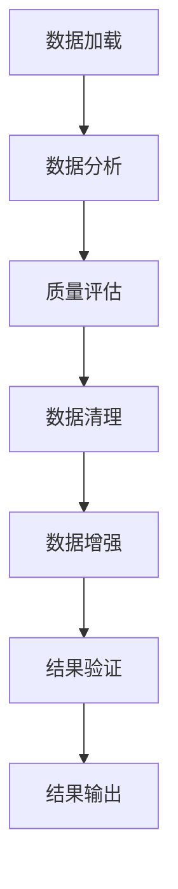

# RFC: 增强飞桨多模态大模型套件（PaddleMIX）的数据处理与分析能力

|              |                             |
| ------------ | --------------------------- |
| **提交作者**  | GreatV                      |
| **提交时间**  | 2024-12-23                  |
| **RFC 版本号**| v1.0                        |
| **文件名**    | enhance_paddlemix_llava.md  |

## 1. 概述

### 1.1 相关背景

飞桨多模态大模型套件（PaddleMIX）广泛应用于图文、视频、音频等多模态任务，涵盖金融文档分析、多模态医疗辅助诊断、电商智能营销、教育拍照解题等多个领域。随着多模态数据集（如 LLaVA v1.5 mix665k，包含图像及其文本描述）的日益普及，PaddleMIX 的数据处理能力亟需提升，以满足更高质量的数据处理需求。

在多模态模型的训练过程中，数据的质量、分布和均衡性直接影响模型的最终表现。然而，当前的 PaddleMIX 缺乏针对图像与文本描述配对的细粒度分析与高效处理工具，这迫使用户在数据清理、筛选和增强方面投入大量额外精力。

### 1.2 功能目标

本项目旨在通过以下几方面增强 PaddleMIX 的数据处理与分析能力，专注于 LLaVA v1.5 mix665k 数据集：

1. **提升数据处理能力**：实现高效的数据加载与预处理，提供细粒度的数据分析能力，支持可配置的数据处理流程和分布式处理。
2. **质量分析与过滤**：开发图像质量评估、文本质量分析及图文匹配度计算算子，并支持 GPU 加速以提升处理效率。
3. **数据增强与分析工具**：实现样本重复检测与去重、模态均衡性分析、数据分布可视化以及处理效果评估报告生成。
4. **标准化接口与工具**：设计统一的 API，完善文档说明，开发可视化分析界面，并支持配置驱动的处理流程。

### 1.3 意义

增强后的 PaddleMIX 数据处理能力将显著简化开发者的训练与微调流程，提升 LLaVA 数据集在多模态任务中的适配效果。此外，这一改进将进一步提升飞桨在全球多模态技术开发社区中的竞争力，促进技术创新和社区发展。

## 2. 方案背景

### 2.1 数据特点与挑战

LLaVA v1.5 mix665k 数据集具有以下主要特点和挑战：

- **数据质量差异**：图像可能存在模糊、低分辨率问题，文本描述可能包含语法错误和逻辑缺陷，标注质量不一致。
- **图文相关性**：部分样本的图文匹配度低，存在语义不一致问题，描述细节可能存在遗漏或冗余。
- **数据分布**：样本类别分布不均衡，文本长度分布不合理，图像分辨率差异较大。

### 2.2 数据处理的重要性

高质量的数据处理对多模态模型的训练效果、收敛速度、推理性能和泛化能力有直接影响。因此，提升数据处理的质量和效率对于优化模型性能至关重要。

## 3. 目标调研

### 3.1 现有工具分析

**Data-Juicer** 和 **当前的 PaddleMIX 工具** 是本项目主要参考的现有工具。

- **Data-Juicer** 具备模块化算子设计、完善的数据处理流程和多模态支持的优势，但未针对 LLaVA 优化，处理效率有待提升，且可视化能力有限。
- **PaddleMIX 当前工具** 与框架深度集成，基础功能完善且使用简便，但缺乏专业分析工具，数据处理灵活性不足，性能优化空间较大。

### 3.2 提升方向

为了克服现有工具的局限，本项目将在以下几个方面进行提升：

1. **性能优化**：支持 GPU 加速，提供分布式处理能力，并优化内存使用。
2. **功能增强**：增加专业分析工具，提升可视化能力，优化数据处理流程。
3. **易用性提升**：完善文档，提供示例教程和配置模板，以降低使用门槛。

## 4. 设计思路与实现方案

### 4.1 核心模块设计

核心模块包括数据分析模块、数据清理模块、数据增强模块和可视化模块，每个模块具备独特的功能和关键特性：

| **模块**          | **功能**                          | **关键特性**                                 |
|-------------------|-----------------------------------|---------------------------------------------|
| **数据分析模块**   | 质量分析、相关性检查、分布分析       | 多维度分析指标、可视化报告、实时监控         |
| **数据清理模块**   | 重复检测、质量过滤、异常处理         | 高效去重算法、自适应过滤、异常修复           |
| **数据增强模块**   | 图像增强、文本增强、样本扩充         | 多种增强策略、质量保证、并行处理             |
| **可视化模块**     | 数据统计、效果展示、结果对比         | 交互式界面、多维度展示、实时更新             |

### 4.2 核心算子设计

核心算子设计涵盖图像质量评估、文本质量分析、图文匹配度评估、数据集分析和数据增强，具体如下：

| **算子名称**               | **功能**           | **标签**     | **优先级** | **技术实现**                                                   | **性能目标**                                      |
|----------------------------|--------------------|--------------|------------|----------------------------------------------------------------|--------------------------------------------------|
| image_quality_filter       | 图像质量评估       | Image        | 高         | Laplacian/FFT 清晰度评估、分辨率检查、美观度评分                | 单图处理时间 <100ms，支持 GPU 加速，内存占用可控   |
| text_quality_filter        | 文本质量分析       | Text         | 高         | 语言模型评分、语法检查、语义分析                              | 批处理效率高，支持多语言，规则可配置               |
| image_text_matching_filter | 图文匹配度评估     | Multimodal   | 高         | 使用 CLIP 模型进行相似度计算、阈值过滤                         | 批量处理优化，显存管理良好，保证高准确率           |
| dataset_balance_analyzer   | 数据集分析         | General      | 中         | 统计分析、分布计算、可视化输出                                 | 支持大规模数据，实时统计，生成详细报告             |
| data_augmentation_mapper   | 数据增强           | General      | 中         | 图像变换、文本改写、质量控制                                   | 并行处理，资源优化，保证增强后数据质量             |

### 4.3 处理流程设计

整个数据处理流程包括数据加载、数据分析、质量评估、数据清理、数据增强、结果验证和结果输出七个阶段。以下是流程图及各阶段的具体任务：

**各阶段具体任务：**

1. **数据加载阶段**：高效读取 LLaVA 数据集，支持多种数据格式。
2. **数据分析阶段**：进行数据分布统计、质量指标计算和异常样本检测。
3. **质量评估阶段**：对图像和文本进行质量评分，并计算图文匹配度。
4. **数据清理阶段**：去除重复样本，过滤低质量样本，修复异常样本。
5. **数据增强阶段**：执行图像增强、文本改写和样本扩充，以优化数据平衡性。
6. **结果验证阶段**：验证质量指标，检查数据分布，进行样本随机核验。
7. **结果输出阶段**：生成处理报告，输出清理与增强后的数据集。

## 5. 测试和验收的考量

### 5.1 测试内容

测试分为单元测试、性能测试、集成测试和效果验证四个部分：

- **单元测试**：确保代码覆盖率超过85%，所有算子具备对应的测试用例，并包含异常输入和边界条件的处理测试。
- **性能测试**：在8卡A100环境下处理10万条数据不超过1小时，内存占用峰值不超过显存的80%，支持多进程并行处理，并监控CPU使用率。
- **集成测试**：进行完整流程测试、多配置场景测试及异常恢复测试，确保系统的稳定性和可靠性。
- **效果验证**：评估LLaVA v1.5训练效果的提升，处理后数据质量的评估，以及收集用户体验反馈。

### 5.2 验收标准

验收标准包括功能验收、性能验收和代码验收：

1. **功能验收**：所有规划功能需完整实现，接口符合设计规范，文档需完整规范。
2. **性能验收**：满足性能指标要求，资源占用合理，系统稳定性达标。
3. **代码验收**：代码需符合规范，通过Code Review，测试用例需完备。

## 6. 可行性分析与排期规划

### 6.1 可行性分析

项目具备良好的技术可行性，基于现有框架可以实现预期功能，核心算法已验证，性能目标可达成。资源需求方面，需要4-8张A100 GPU，合适的开发人员配置以及充足的存储资源保障。

### 6.2 排期规划

项目计划在五周内完成，具体任务和目标如下：

| 时间   | 任务                                                          | 目标                     |
|--------|---------------------------------------------------------------|--------------------------|
| 第1周  | 完成核心算子框架搭建，实施图像和文本质量评估算子，编写基础单元测试 | 框架可用，基础功能完成   |
| 第2-3周| 实现其他高优先级算子，优化算子性能，补充测试用例，开发可视化工具 | 所有算子可用，性能达标   |
| 第4周  | 在LLaVA数据集上验证，撰写技术文档，完善使用说明，开发示例代码 | 整体功能验证完成         |
| 第5周  | 提交PR审查，修复问题，完善文档，准备发布                     | 代码合入主分支           |

## 7. 影响面

### 7.1 技术影响

本项目将显著提升 PaddleMIX 的数据处理能力，优化多模态训练流程，并建立数据处理的行业标准。

### 7.2 生态影响

项目将促进社区参与，提升框架的影响力，并带动相关技术的创新与发展。

### 7.3 用户收益

用户将享受到更低的使用门槛、更高的开发效率以及优化后的训练效果，提升整体使用体验。

## 8. 后续规划

项目完成后，将持续进行以下工作：

1. **持续优化**：进一步提升性能，开发新功能，完善文档。
2. **生态建设**：加强社区互动，积累使用案例，提供培训支持。
3. **技术演进**：研究新算法，升级框架，制定行业标准。
