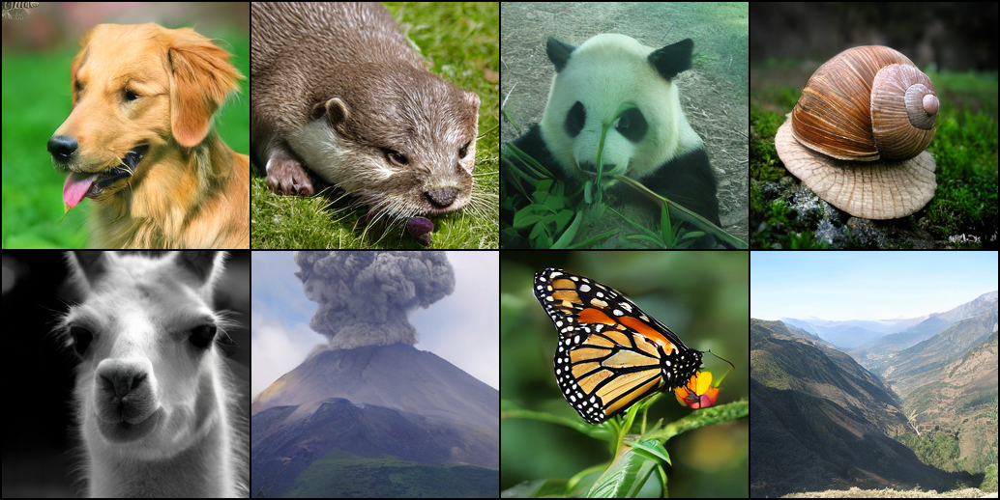

# Autoregressive Image Generation without Vector Quantization <br><sub>Paddle Implementation</sub>

## 1. 模型介绍

[MAR（Masked AutoRegressive）](https://github.com/LTH14/mar)
框架是一种结合自回归建模与掩码生成的新型图像生成方法，旨在摆脱传统自回归模型对向量量化（VQ）的依赖。其核心创新在于引入**扩散损失（Diffusion Loss）**，通过扩散过程建模每个连续值标记（token）的概率分布，替代传统的交叉熵损失，从而支持非离散的标记空间。MAR采用双向注意力机制，允许所有已知标记相互通信，提升信息传递效率，并通过随机掩码策略在训练中逐步生成图像。在推理阶段，模型以随机顺序预测多标记集合，结合温度控制采样过程，平衡生成多样性与保真度。实验表明，MAR在ImageNet 256×256数据集上实现了1.55的FID（使用分类器引导），生成速度达每图<0.3秒，显著优于传统自回归及扩散模型。此外，MAR支持灵活标记器（如KL-16、VQ-16），并通过统一框架兼容标准自回归与掩码生成范式，为连续域序列建模开辟了新方向。
本项目是该论文的Paddle迁移实现。
[GitHub仓库](https://github.com/LTH14/mar)
[Huggingface仓库](https://huggingface.co/jadechoghari/mar)
[Autoregressive Image Generation without Vector Quantization](https://arxiv.org/abs/2406.11838) (Neurips 2024 Spotlight Presentation)

**原项目提供的模型权重:**

|                                                     MAR Model                                                     | FID-50K | Inception Score | params |
|:-----------------------------------------------------------------------------------------------------------------:|:-------:|:---------------:|:------:|
|  [mar-base.safetensors](https://huggingface.co/jadechoghari/mar/resolve/main/mar-base.safetensors?download=true)  |  2.31   |      281.7      |  832M  |
| [mar-large.safetensors](https://huggingface.co/jadechoghari/mar/resolve/main/mar-large.safetensors?download=true) |  1.78   |      296.0      | 1.91G  |
|  [mar-huge.safetensors](https://huggingface.co/jadechoghari/mar/resolve/main/mar-huge.safetensors?download=true)  |  1.55   |      303.7      | 3.77G  |

注：点击下载完成后，使用`exchange/mar`里的转换脚本转换为Paddle可用的`pdparams`权重格式

## 2 环境准备

1) 准备`python`环境

`Python`版本要求为3.8，建议使用`conda`或`miniconda`环境
```shell
# 准备miniconda环境
mkdir -p ~/miniconda3
wget https://repo.anaconda.com/miniconda/Miniconda3-latest-Linux-x86_64.sh -O ~/miniconda3/miniconda.sh
bash ~/miniconda3/miniconda.sh -b -u -p ~/miniconda3
source ~/miniconda3/bin/activate
# 创建python环境
conda create -n [your env name] python=3.8
conda activate [your env name]
# 设置清华源
pip config set global.index-url https://pypi.tuna.tsinghua.edu.cn/simple
```

2) 安装pip依赖及[PaddlePaddle-Gpu](https://www.paddlepaddle.org.cn/documentation/docs/zh/develop/install/pip/windows-pip.html)

进入`models/mar`文件夹，加载`requirements.txt`
```bash
cd PaddleMIX/paddlemix/models/mar
pip install -r requirements.txt

# 安装GPU版本Paddle注意核对cuda版本
python -m pip install paddlepaddle-gpu==3.0.0 -i https://www.paddlepaddle.org.cn/packages/stable/cu118/
```

3) VAE、MAR权重的下载与转换
* VAE[下载](https://www.dropbox.com/scl/fi/hhmuvaiacrarfg28qxhwz/kl16.ckpt?rlkey=l44xipsezc8atcffdp4q7mwmh&dl=0)与转换
```bash
# 退回并切换到 examples/mar 文件夹，或全部使用绝对地址
cd ../../examples/mar
# 转换脚本
python  exchange/mar/exchange_weight_for_vae.py \
    --torch_path "kl16.ckpt" \
    --paddle_path "exchange/mar/VAE_kl16_ckpt.pdparams"
```
* MAR权重[下载](https://huggingface.co/jadechoghari/mar/tree/main)与转换
[mar-base.safetensors](https://huggingface.co/jadechoghari/mar/resolve/main/mar-base.safetensors?download=true)
[mar-large.safetensors](https://huggingface.co/jadechoghari/mar/resolve/main/mar-large.safetensors?download=true)
[mar-huge.safetensors](https://huggingface.co/jadechoghari/mar/resolve/main/mar-huge.safetensors?download=true)

```bash
# 转换脚本
python  exchange/mar/exchange_weight_for_model.py \
    --torch_path "mar-huge.safetensors" \
    --paddle_path "exchange/mar/paddle_mar_huge.pdparams"
```
注：VAE权重的格式为`ckpt`，MAR madel权重格式为`safetensors`，如使用上述脚本路径，请将下载完成的权重文件放置在此`README.md`同级文件夹下

## 3 快速开始
完成环境准备后，可以实现 [IMAGENET 1000 Class List](https://deeplearning.cms.waikato.ac.nz/user-guide/class-maps/IMAGENET/) 生成示例：

推荐使用ipynb脚本

### 图片生成
```bash
python mar_demo.py \
    --model_type "mar_huge" \
    --model_path "exchange/mar/paddle_mar_huge.pdparams" \
    --vae_path "exchange/mar/VAE_kl16_ckpt.pdparams" \
    --labels "[207, 360, 388, 113, 355, 980, 323, 979]"
```
可配置参数说明：
  * `model_type`: 模型类型
  * `model-path`: 转换后的模型权重路径
  * `vae_path`: 转换后的VAE权重路径
  * `labels`: 输出图片的类别

注：模型类型需要与权重类型保持一致

选定`labels`类别：[207, 360, 388, 113, 355, 980, 323, 979]

输出图片：



### 参考文献
```BibTeX
@article{li2024autoregressive,
  title={Autoregressive Image Generation without Vector Quantization},
  author={Li, Tianhong and Tian, Yonglong and Li, He and Deng, Mingyang and He, Kaiming},
  journal={arXiv preprint arXiv:2406.11838},
  year={2024}
}
```
