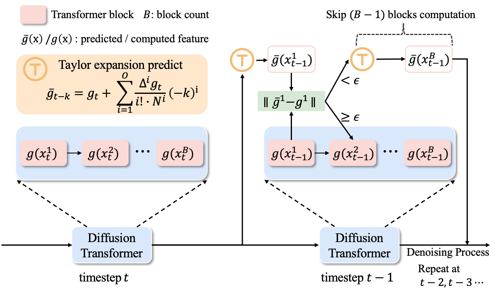

# Forecasting When to Forecast: Accelerating Diffusion Models with Confidence-Gated Taylor
This is the implementation of CG-Taylor for  Accelerating  Diffusion Models.

[Forecasting When to Forecast: Accelerating Diffusion Models with Confidence-Gated Taylor](http://arxiv.org/abs/2508.02240)

If you have any question, please contact [liuxiaoguan@whu.edu.cn](liuxiaoguan@whu.edu.cn).
## Abstract
Diffusion Transformers (DiTs) have demonstrated remarkable performance in visual generation tasks. However, their low inference speed limits their deployment in low-resource applications. Recent training-free approaches exploit the redundancy of features across timesteps by caching and reusing past representations to accelerate inference. Building on this idea, TaylorSeer instead uses cached features to predict future ones via Taylor expansion. However, its module-level prediction across all transformer blocks (e.g., attention or feedforward modules) requires storing fine-grained intermediate features, leading to notable memory and computation overhead.  Moreover, it adopts a fixed caching schedule without considering the varying accuracy of predictions across timesteps, which can lead to degraded outputs when prediction fails. To address these limitations, we propose a novel approach to better leverage Taylor-based acceleration. First, we shift the Taylor prediction target from the module level to the last block level, significantly reducing the number of cached features. Furthermore, observing strong sequential dependencies among Transformer blocks, we propose to use the error between the Taylor-estimated and actual outputs of the first block as an indicator of prediction reliability. If the error is small, we trust the Taylor prediction for the last block; otherwise, we fall back to full computation, thereby enabling a dynamic caching mechanism.
Empirical results show that our method achieves a better balance between speed and quality, achieving a 3.17x acceleration on FLUX, 2.36x on DiT, and 4.14x on Wan Video with negligible quality drop.

## Usage
###  Environment Preparation
just follow the guidance here: [ppdiffusers](https://github.com/PaddlePaddle/PaddleMIX/tree/develop/ppdiffusers#readme)
### Checkpoints Download
The inference code will download the weights automatically.
### Inference
#### Key Parameter
| parameter | description | name |
| --- | --- | --- |
| `confidence gate` | the error threshold for taylor forcast | pipe.transformer.threshold
| `first block order` | the taylor order for first block | cache_dic['max_order']
| `last block order` | the taylor order for last block | cache_dic['firstblock_max_order']
#### FLUX.1-dev
```shell
cd FLUX.1-dev
python stext_to_image_generation_cg-taylor_flux.py \
## confidence gate=0.13/0.03 first block order=1 last block order=1

```
#### HunyuanVideo
```shell
cd HunyuanVideo
python text_to_video_generation-hunyuan_video_cg-taylor.py \
```
#### Wan2.1
```shell
cd Wan2.1
python text_to_video_generation-Wan_video_cg-taylor.py \
## confidence gate=0.36 first block order=3 last block order=1
```
#### DiT
The code will be released here: [CG-Taylor-DiT](https://github.com/liuxiao-guan/CG-Taylor-DiT)

<!-- | `width` | the width of the output image |
| `num_inference_steps` | the number of diffusion steps |
| `guidance_scale` | the scale of the classifier-free guidance |
| `seed` | the seed for random number generator | -->

## Citation
```bibtex
@article{guan2025forecasting,
  title={Forecasting When to Forecast: Accelerating Diffusion Models with Confidence-Gated Taylor},
  author={Xiaoliu Guan, Lielin Jiang, Hanqi Chen, Xu Zhang, Jiaxing Yan, Guanzhong Wang, Yi Liu, Zetao Zhang, Yu Wu},
  journal={arXiv preprint arXiv:2508.02240},
}
```
