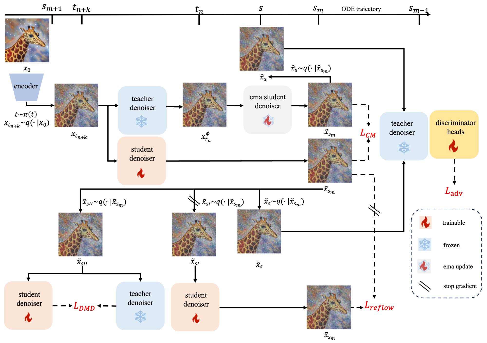

# FLUX-Lightning

## 1. 模型简介

PPDiffusers提出了基于FLUX的蒸馏加速模型FLUX-Lightning，可以在4步极少步数下，生成高分辨率高质量的图像，定量指标和定性指标均超越业界开源和闭源模型，达到了业界SOTA水平。
<p align="center">
  
</p>

FLUX-Lightning模型主要包含4个部分，区间一致性蒸馏（Phased Consistency Distillation），对抗学习（Adversarial Learning），分布匹配蒸馏（Distribution Matching Distillation），矫正流损失（reflow loss），完整框架如下图所示
<p align="center">
  
</p>

下面给出了和其他基于FLUX的蒸馏加速模型的定量指标对比，评估指标包括FID-FLUX和CLIP。参与对比的竞品包括TDD (Target-Driven Distillation: Consistency Distillation with Target Timestep Selection and Decoupled Guidance)，SwD (Scale-wise Distillation of Diffusion Models)，Hyper-FLUX和FLUX schnell

| Method                | FID-FLUX ↓ | CLIP ↑  |
|-----------------------|------------|---------|
| TDD                   | 18.383     | 0.3276  |
| SwD                   | 9.7685     | 0.3302  |
| Hyper-FLUX            | 9.1534     | 0.3250  |
| FLUX schnell          | 13.8074    | 0.3429  |
| FLUX-Lightning (ours) | 8.0182     | 0.3294  |


## 2. 数据准备

下载laion训练数据和数据列表

```bash
wget https://dataset.bj.bcebos.com/PaddleMIX/flux-lightning/laion-45w.tar.gz
wget https://dataset.bj.bcebos.com/PaddleMIX/flux-lightning/filelist_hwge1024_pwatermarkle0.5.txt
```

数据解压之后，文件结构如下所示

```bash
|-- your_path
   |-- laion-45wlaion-45w
      ｜-- 0000000.txt
      ｜-- 0000001.txt
      ｜-- 0000002.txt
      ....
   |-- filelist_hwge1024_pwatermarkle0.5.txt
```

## 3. FLUX-Lightning LoRA训练

### 3.1 硬件要求

示例脚本配置在显存 80GB 的显卡上可正常训练

### 3.2 训练脚本

```bash
export FLAGS_use_fused_rmsnorm="yes"
python -u -m paddle.distributed.launch --gpus "0,1,2,3,4,5,6,7" train_flux_lightning_lora.py \
    --data_path "your_path/laion-45w" \
    --file_list_path "your_path/filelist_hwge1024_pwatermarkle0.5.txt" \
    --pretrained_teacher_model "black-forest-labs/FLUX.1-dev" \
    --output_dir outputs/lora_flux_lightning \
    --tracker_project_name lora_flux_lightning \
    --mixed_precision "bf16" \
    --fp16_opt_level "O2" \
    --resolution "1024" \
    --lora_rank "32" \
    --learning_rate "5e-6" \
    --loss_type "huber" \
    --adam_weight_decay "1e-3" \
    --max_train_steps "28652" \
    --dataloader_num_workers "32" \
    --guidance_scale "3.5" \
    --validation_steps "20000" \
    --checkpointing_steps "1000" \
    --checkpoints_total_limit "30" \
    --train_batch_size "1" \
    --gradient_accumulation_steps "1" \
    --resume_from_checkpoint "latest" \
    --seed "453645634" \
    --num_euler_timesteps "100" \
    --multiphase "4" \
    --gradient_checkpointing \
    --adv_weight 0.1 \
    --adv_lr 1e-5 \
    --pre_alloc_memory 76 \
    --use_dmd_loss \
    --dmd_weight 0.01 \
    --apply_reflow_loss \
    --reflow_loss_weight 0.01
```
参数说明
* `--data_path`: 训练数据集路径
* `file_list_path`: 训练数据列表路径
* `--pretrained_teacher_model`: 预训练的Stable Diffusion模型路径
* `--output_dir`：输出文件夹路径
* `--tracker_project_nam`：wandb项目名称
* `--mixed_precision`：是否开启混合精度训练
* `--fp16_opt_level`: 混合精度训练的优化级别，可选O1、O2
* `--resolution`：训练分辨率
* `--lora_rank`：lora rank
* `--learning_rate`：学习率
* `--loss_type`：损失类型
* `--guidance_scale`：guidance scale
* `--adam_weight_decay`：adam优化器的权重衰减
* `--max_train_steps`：训练step数量
* `--dataloader_num_workers`：读取数据的线程数
* `--validation_steps`：验证间隔step数
* `--checkpointing_steps`：保存checkpoint间隔step数
* `--checkpoints_total_limit`：保存的checkpoint数量上限
* `--train_batch_size`：训练batch size
* `--gradient_accumulation_steps`：梯度累积步数
* `--resume_from_checkpoint`: 恢复训练的checkpoint路径
* `--seed`: 随机种子
* `--num_euler_timesteps`：euler solver的timestep数量
* `--multiphase`: 多阶段的数量
* `--gradient_checkpointing`: 是否开启梯度检查点
* `--adv_weight`：adversarial loss的权重
* `--adv_lr`：Discriminator的学习率
* `--pre_alloc_memory`：预分配的GPU显存（可选），需要小于实际的GPU显存
* `--use_dmd_loss`: 是否使用dmd loss
* `--dmd_weight`: dmd loss的权重
* `--apply_reflow_loss`: 是否使用reflow loss
* `--reflow_loss_weight`: reflow loss的权重

## 4. 模型推理

下载模型权重
```bash
wget https://dataset.bj.bcebos.com/PaddleMIX/flux-lightning/paddle_lora_weights.safetensors
```
推理命令
```bash
python text_to_image_generation_flux_lightning.py --path_to_lora your_path/paddle_lora_weights.safetensors --prompt "a beautiful girl" --output_dir ./
```

飞桨框架深度学习编译器CINN(Compiler Infrastructure for Neural Networks)加速推理，命令：
```bash
export FLAGS_use_cuda_managed_memory=true
export FLAGS_prim_enable_dynamic=true
export FLAGS_prim_all=true
export FLAGS_use_cinn=1
python text_to_image_generation_flux_lightning_cinn.py --path_to_lora your_path/paddle_lora_weights.safetensors --prompt "a beautiful girl" --output_dir ./ --inference_optimize
```

## 参考论文
- [FLUX](https://github.com/black-forest-labs/flux)
- [Phased Consistency Models](https://arxiv.org/abs/2405.18407)
- [Flash Diffusion: Accelerating Any Conditional Diffusion Model for Few Steps Image Generation](https://arxiv.org/abs/2406.02347)
- [Self-Corrected Flow Distillation for Consistent One-Step and Few-Step Text-to-Image Generation](https://arxiv.org/abs/2412.16906)
