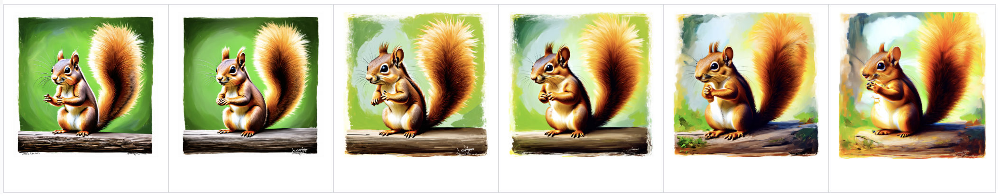

# TeaCache
> **TeaCache（Timestep Embedding Aware Cache）** 是一种**training-free**推理加速方法：
> 它通过 timestep embedding 估计各时间步输出变化，将**变化小**的层输出直接缓存并复用，可为图像 / 视频 / 音频扩散模型带来 **1.5–2×** 的速度提升，几乎不损失质量。


## 快速上手（以 SD3 为例）
[TeaCache](https://github.com/LiewFeng/TeaCache) 可在**无需重新训练**的前提下，将 SD3 的推理速度提升约 2 倍，而且几乎不会降低视觉质量。
下图展示了在不同 `rel_l1_thresh` 取值下（0 = 原始、0.2 = 1.60x 提速、0.3 = 1.80x、0.4 = 2.38x、0.6 = 2.82x、0.8=3.53x）使用 TeaCache‑SD3 生成的效果对比：



### 📈 单张 A100-40G 显卡上的推理延迟对比

| rel_l1_thresh | 0          | 0.2          | 0.3          | 0.4          | 0.6          | 0.8          |
|--------------:|-----------:|-------------:|-------------:|-------------:|-------------:|-------------:|
| **ips**       | 8.00 it/s  | 12.80 it/s   | 14.38 it/s   | 19.02 it/s   | 22.55 it/s   | 28.24 it/s   |
| **speedup**   | 1×         | 1.60×        | 1.80×        | 2.38×        | 2.82×        | 3.53×        |

### 使用方法
在脚本中调整 rel_l1_thresh，以在速度与视觉质量之间取得理想平衡。
```
python teacache_flux.py
```
